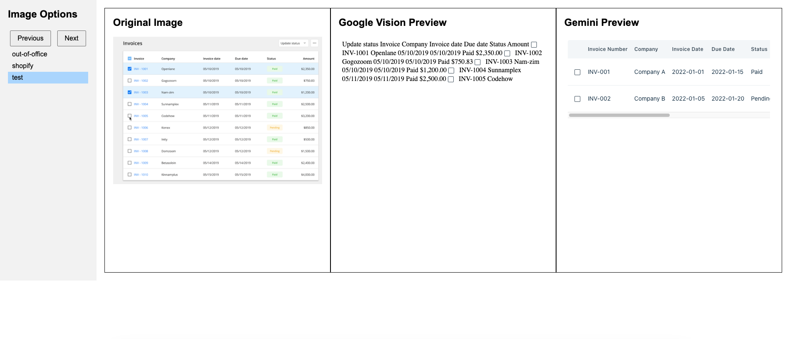

## Steps to check gemini results

1. Add the data folder in the rootwith the following structure

```
data
  - design-images
    - image1.jpg
    - image2.jpg
    - ...
  - gemini-1.0
    - image1.html
    - image2.html
    - ...
  - gemini-1.5
    - image1.html
    - image2.html

```


2. Add the image names in the `index.js` at 


```javascript
const imageData = [
  "out-of-office",
  "shopify",
  'test'
  // Add more images here
];
```

3. Check by locally runnning the index.html file
```bash
npx http-server -p 3002
```
This will open a server on port 3002 and you can access the page by navigating to `http://127.0.0.1:3002/results/gemini-results/`




